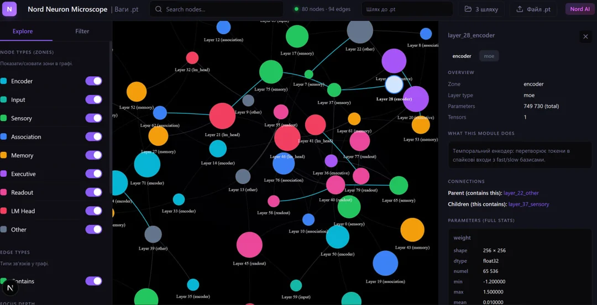

<p align="center">
  
</p>

<h1 align="center">⚡ Project Nord v4.2</h1>

<p align="center">
  <b>Brain-Inspired Spiking Neural Network Language Model</b><br>
  <i>Spike-Driven MoE · Zonal Specialization · 91% Sparsity · 140M Parameters</i>
</p>

<p align="center">
  <a href="https://www.reddit.com/r/LocalLLaMA/"></a>
  
  
  
  
</p>

---

## What is Nord?

Nord is a **spiking neural network (SNN) language model** that processes text using biologically-inspired spike patterns instead of continuous activations. Unlike standard transformers where 100% of neurons are active for every token, Nord activates only **3-9% of neurons** at any time — with different brain-inspired zones specializing in different functions.

This is not a fine-tuned LLM. Nord is trained **from scratch** with a novel architecture that combines:

- **Leaky Integrate-and-Fire (LIF) neurons** with surrogate gradients
- **Spike-Driven Mixture of Experts (MoE)** routing
- **Brain-inspired zonal organization** (Sensory → Association → Memory → Executive)
- **Temporal spike coding** across multiple timesteps
- **91% average sparsity** during both training and inference

## Why Spikes?

Standard transformers activate all parameters for every token. A 70B model uses 70B parameters per token, regardless of complexity.

Spiking networks are fundamentally different: neurons communicate through discrete spikes, and most neurons are silent most of the time. This means:

| | Transformer | Nord SNN |
|---|---|---|
| **Active params per token** | 100% | 3-9% |
| **Computation** | Dense matrix multiply | Sparse spike events |
| **Energy model** | GPU-optimized | Neuromorphic-compatible |
| **Biological similarity** | Low | High |

If SNN language models can match transformer quality at scale, they could run 86B-parameter models with the compute cost of a 3-4B model.

## Architecture

```
┌─────────────────────────────────────────────────────────────┐
│                    TEMPORAL SPIKE ENCODER                    │
│         Token → 8 fast + 2 slow timestep currents           │
├─────────────────────────────────────────────────────────────┤
│                                                             │
│  ┌─────────────┐   Spike rates: 8-16%                      │
│  │  SENSORY    │   2 blocks, standard FFN                   │
│  │  ZONE       │   Feature extraction                       │
│  └──────┬──────┘                                            │
│         │                                                   │
│  ┌──────▼──────┐   Spike rates: 15-27%                     │
│  │ ASSOCIATION │   2 blocks, Spike-Driven MoE               │
│  │    ZONE     │   4 experts, top-2 routing                 │
│  └──────┬──────┘                                            │
│         │                                                   │
│  ┌──────▼──────┐   Memory neurons: 128                     │
│  │   MEMORY    │   τ=0.99, gated temporal attention         │
│  │   CORTEX    │   Multi-head readout over all timesteps    │
│  └──────┬──────┘                                            │
│         │                                                   │
│  ┌──────▼──────┐   Spike rates: 17-26%                     │
│  │ EXECUTIVE   │   2 blocks, standard FFN                   │
│  │    ZONE     │   Decision & output generation             │
│  └──────┬──────┘                                            │
│         │                                                   │
│  ┌──────▼──────┐                                            │
│  │  READOUT    │   EMA over membrane potential              │
│  │  + LM HEAD  │   → vocabulary logits                      │
│  └─────────────┘                                            │
└─────────────────────────────────────────────────────────────┘
```

### Key Components

**Temporal Spike Encoder.** Each token is converted into 10 timestep current injections (8 fast + 2 slow), mimicking how biological neurons encode information through temporal patterns rather than single activations.

**Associative LIF Neurons.** Every layer uses Leaky Integrate-and-Fire neurons with learnable membrane time constants, voltage thresholds, synaptic currents, and cascade amplification across neural clusters. Spikes are generated through a differentiable ATan surrogate gradient.

**Spike-Driven MoE.** Association zone blocks route tokens through 4 specialized experts based on spike-rate cluster activity. Only top-2 experts process each token. Load balancing loss prevents expert collapse.

**Memory Cortex.** A persistent memory module with slow time constant (τ=0.99) that accumulates information across tokens. Uses multi-head temporal attention to read from all timesteps, with a learned gating mechanism that controls memory influence.

**Zonal Specialization.** The model self-organizes into functionally distinct zones during training — no manual assignment. Sensory zones develop low firing rates for feature extraction, while executive zones develop higher rates for decision-making. This mirrors biological cortical organization.

## Training Results

### Loss Curve

Training on ~2.2M text samples from a general English corpus, single NVIDIA A5000 (24GB):

| Step | Loss | Sparsity | LR | Note |
|------|------|----------|-----|------|
| 0 | 8.9 | 68% | warmup | Training start |
| 1,500 | 6.2 | 69% | 3.0e-04 | Rapid descent |
| 5,000 | 5.35 | 95% | 3.0e-04 | — |
| 10,000 | 4.95 | 99% | 3.0e-04 | Plateau (v4.1) |
| 14,000 | 7.6→5.2 | 75% | 3.0e-04 | v4.2 fixes applied |
| 20,000 | 4.70 | 91% | 3.0e-04 | New minimum |
| 30,000 | 4.50 | 91% | 1.2e-04 | Cosine decay starts |
| 39,000 | 4.30 | 91% | 6.0e-05 | Current best |

### Zonal Spike Rates (step 32K)

```
Zone              Spike Rate    Role
─────────────────────────────────────────
Sensory [0]       8-10%         Low-level feature extraction
Sensory [1]       8-10%         Mid-level features
Association [0]   10-13%        MoE routing & specialization
Association [1]   10-14%        Cross-expert integration
Memory Cortex     0.5-1%        Selective long-term storage
Executive [0]     11-15%        Decision formation
Executive [1]     22-26%        Final output generation
─────────────────────────────────────────
Overall Sparsity: 89-95%
```

The model **self-organizes** this hierarchy — no explicit supervision forces different zones to have different firing rates. This emergent specialization mirrors biological cortical organization.

### Generation Examples (progression)

**Step 3,600 (loss 5.5):**
> "Queen was being too late. The lake is not to be found in a variety of birds and stynesan trees."

**Step 29,000 (loss 4.5):**
> "The internet is equipped with computers that harness data from television and radio vehicles. Its central and large uses can help business use and share information on devices and systems."

**Step 39,000 (loss 4.3):**
> "A cybersecurity campaign that uses a computer science machine learning robot to guide players, and has refined algorithms. The popular game research software made by OpenAI security researchers..."

Text quality improves steadily with training. At 140M parameters, coherent multi-sentence generation requires loss < 3.5, which would need significantly more training compute.

## Version History

| Version | Parameters | Key Innovation | Result |
|---------|-----------|----------------|--------|
| v3 | 144M | First SNN LLM, 97% sparsity | 51K Reddit views, loss 4.4 at 54K steps |
| v3.5 | 500M | Scale test | Sparsity stuck at 100% (spikes dead) |
| v4.1 | 140M | Spike-driven MoE, zonal architecture, memory cortex | Fixed spike death, loss 4.95 |
| **v4.2** | **140M** | **Executive clamp fix, adaptive spike regulator** | **Loss 4.3, stable 91% sparsity** |

### v4.2 Critical Fixes

- **FIX K:** Spike rate calculation clamped to non-negative (was reporting negative rates)
- **FIX L:** Adaptive spike regulator with 3x asymmetric penalty + anti-death floor
- **FIX M:** Executive zone uses ReLU clamp instead of LeakyClamp (prevents negative spike propagation)

## Quick Start

### Requirements

```bash
pip install torch transformers lmdb numpy
```

### Training

```bash
python train_nord_v4.py
# Will prompt for dataset path (JSONL) and model directory
# Auto-detects GPU and adjusts batch size:
#   8GB  → batch=1, accum=32
#   24GB → batch=2, accum=16
#   48GB → batch=4, accum=8
#   80GB → batch=8, accum=4
```

Dataset format (JSONL):
```json
{"text": "Your training text here..."}
```

### Chat / Inference

```bash
python chat_v4.py
# Commands: /stats, /memory, /expert, /reset, /quit
```

### Configuration (140M)

```python
NordConfig(
    d_model=496, n_heads=8, d_ff=1024,
    n_experts=4, top_k_experts=2,
    sensory_layers=2, association_layers=2, executive_layers=2,
    memory_size=128, T=8, T_slow=2,
    target_spike_rate=0.03, spike_loss_weight=0.5,
    v_threshold=0.12, tau_mem=0.85,
)
```

## Project Structure

```
nord-ai/
├── nord_core_v4.py      # Core architecture (v4.2)
├── train_nord_v4.py     # Training script with cosine LR decay
├── chat_v4.py           # Interactive chat / inference
├── train_nord_500m.py   # Multi-GPU training (500M+ models)
└── README.md
```

## Tools

**Nord Neuron Microscope** — Interactive graph visualization of the full model architecture. Inspect any module: zone, layer type, parameter count, weight statistics. Color-coded by zone.

## Scaling Roadmap

| Scale | Status | Compute Needed |
|-------|--------|----------------|
| 140M | ✅ Training | 1× A5000, ~$15 |
| 500M | 🔄 Planned | 1× L40 48GB, ~$50 |
| 1-2B | 📋 Design | 4× A100 80GB, ~$500 |
| 10B+ | 🔬 Research | Cluster / Grant |

Key question at each scale: **Does zonal specialization persist?** If yes, SNN language models could eventually match transformers in quality while using 10-30x less compute at inference.

## Research Goals

- **NeurIPS 2026** workshop or main conference submission
- Demonstrate that SNN architectures can scale to language modeling
- Prove emergent zonal specialization is a general phenomenon, not an artifact of small scale
- Explore neuromorphic deployment (Intel Loihi, SpiNNaker) for ultra-efficient inference

## Citation

If you use this work in your research:

```bibtex
@software{nord2026,
  title={Project Nord: Brain-Inspired Spiking Neural Network Language Model},
  author={Zemondsa},
  year={2026},
  url={https://github.com/zemondsa/nord-ai}
}
```

## License

Apache 2.0

## Acknowledgments

Built solo by an 18-year-old student in Norway. Trained on rented GPUs. No corporate backing, no lab, no team — just curiosity and persistence.

If you're interested in collaborating, providing compute, or have questions — open an issue or reach out.

---

<p align="center">
  <i>⚡ "Only 3-9% of neurons fire at any time — just like a real brain."</i>
</p>

- FineWeb-Edu dataset by HuggingFace
- My Model https://huggingface.co/zerdovzad/Nord-AI/
- Thank this person for the visual presentation https://mnbnkr.github.io/-Project-Nord-Spiking-Neural-Network-Language-Model/
- Thank this person for the visual presentation https://github.com/mnbnkr
- Visual presentation https://mnbnkr.github.io/-Project-Nord-Spiking-Neural-Network-Language-Model/
- My Wiki https://github.com/gtausa197-svg/-Project-Nord-Spiking-Neural-Network-Language-Model/wiki
